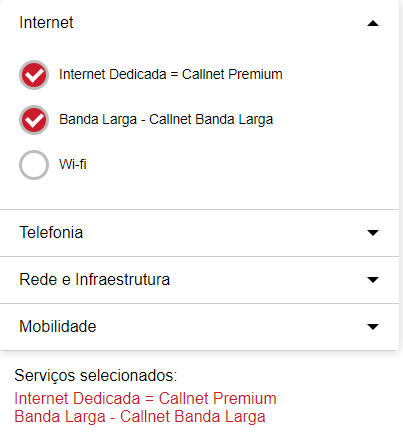

# AccordionWithList

Um código simples utilizado em um formulário de contratação de serviços de uma empresa, onde o cliente seleciona os serviços desejados. Essas informações são inseridas junto com um formulário que não está incluso no código e enviadas para o CRM da empresa.

## Funcionamento

Ao selecionar um serviço, é enviado um parâmetro para o JavaScript, que adiciona o nome do serviço em uma lista. A partir dessa lista, são criados elementos div e p, que são adicionados à div principal.

Quando um serviço é desselecionado, o parâmetro é passado novamente, identificando se a caixa de seleção está marcada (true) ou não (false). Com essa informação, o serviço é removido da lista e o elemento correspondente é removido da div principal.

## Exemplo de imagem



## Como usar

Inclua o seguinte código HTML no seu projeto:

```html
<div class="accordion">
  <!-- Seção 1 -->
  <div class="accordionBorder">
    <input type="radio" name="example_accordion" id="section1" class="accordion__input">
    <label for="section1" class="accordion__label">Internet</label>
    <div class="accordion__content">
      <!-- Lista de serviços da seção 1 -->
    </div>
  </div>
  
  <!-- Seção 2 -->
  <div class="accordionBorder">
    <input type="radio" name="example_accordion" id="section2" class="accordion__input">
    <label for="section2" class="accordion__label">Telefonia</label>
    <div class="accordion__content">
      <!-- Lista de serviços da seção 2 -->
    </div>
  </div>
  
  <!-- Seção 3 -->
  <div class="accordionBorder">
    <input type="radio" name="example_accordion" id="section3" class="accordion__input">
    <label for="section3" class="accordion__label">Rede e Infraestrutura</label>
    <div class="accordion__content">
      <!-- Lista de serviços da seção 3 -->
    </div>
  </div>
  
  <!-- Seção 4 -->
  <div class="accordionBorder">
    <input type="radio" name="example_accordion" id="section4" class="accordion__input">
    <label for="section4" class="accordion__label">Mobilidade</label>
    <div class="accordion__content">
      <!-- Lista de serviços da seção 4 -->
    </div>
  </div>
</div>

Utilize a lógica JavaScript já criada para  adicionar ou remover serviços da lista.
